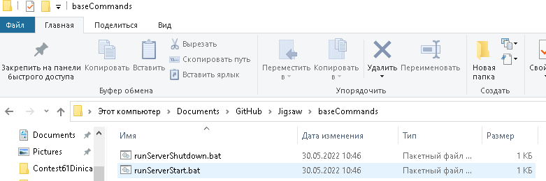
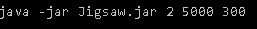
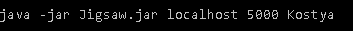
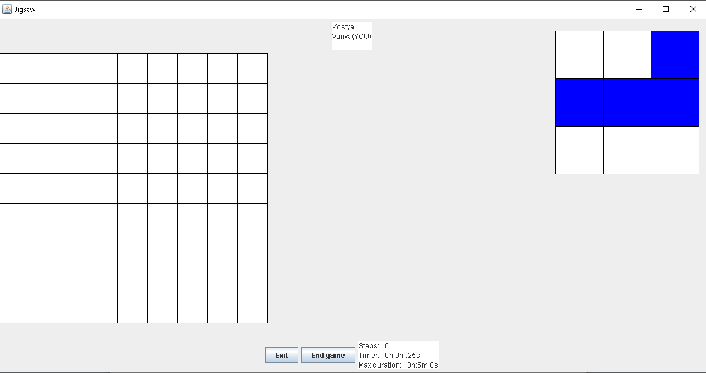
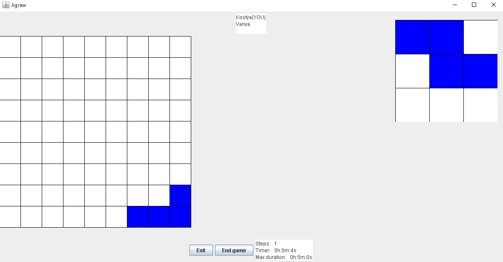
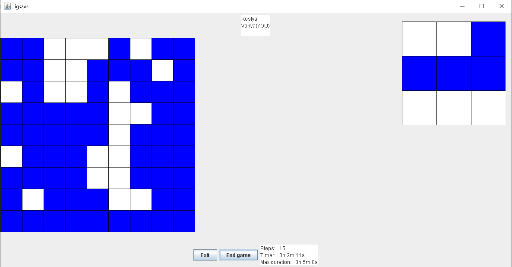
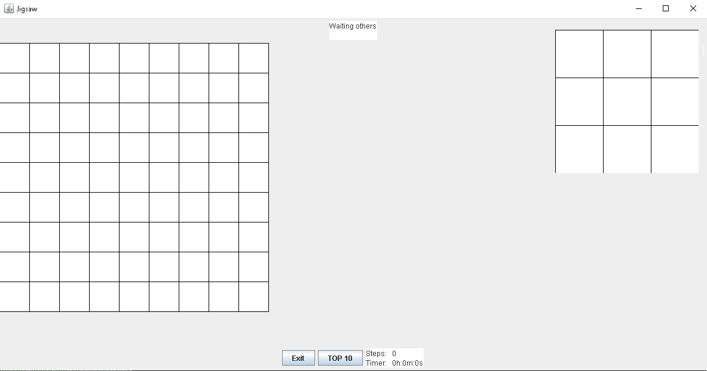
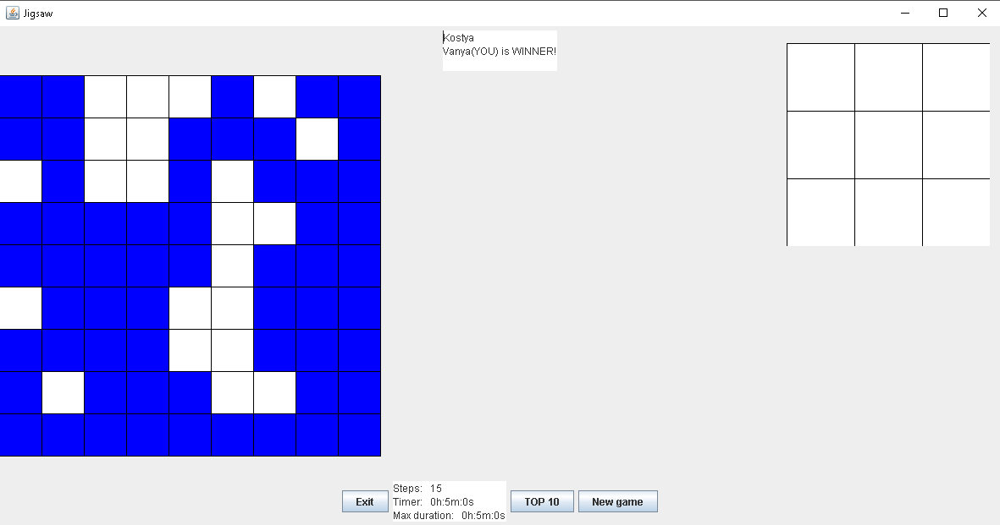
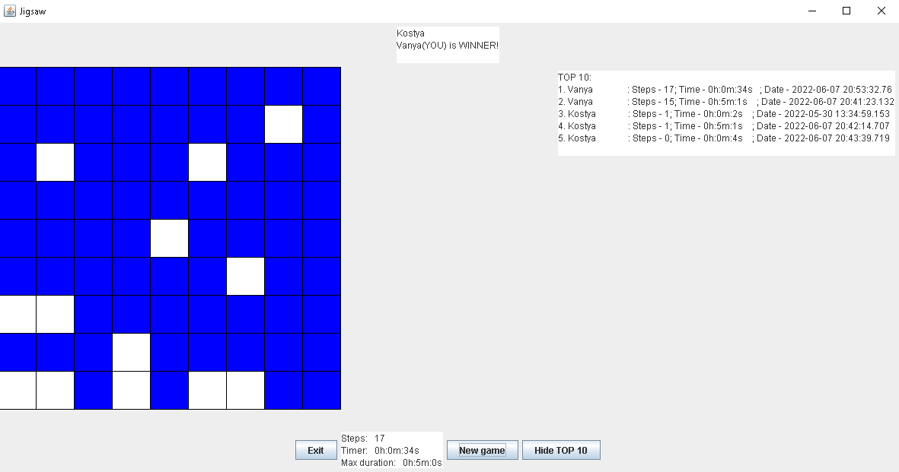

# **How to run Jigsaw?**

**On server:**
- **Run**       *baseCommands/runServerStart.bat* to open connection to the base.
- **Run**       *out/artifacts/JigsawServer_jar/Jigsaw.jar* (Or *JigsawServerRun.main*)    
                 Arguments: 
                        *{Number of players} {Server Port} {Max duration of each game}*
                 Example: 
                        *java -jar Jigsaw.jar 2 5000 300*
- After finishing the game and closing the Jigsaw server
                 **run**         *baseCommands/runServerShutdown.bat* 

**On client:**
- **Run**       *out/artifacts/JigsawClient_jar/Jigsaw.jar* (Or *JigsawClientRun.main*)
                 Arguments: 
                        {Host name} {Server Port} {Player\'s (your) name}*
                 Example: 
                        *java -jar Jigsaw.jar localhost 5000 Kostichka* 

Set a host name "localhost" to run a server and clients from the same
computer.

 

# **What is Jigsaw?**

Jigsaw is a game like Tetris. Firstly, you see a big field and a small
field with a figure. You should drag a figure from the small field and
drop it to the big one. The figure will appear in the place you
dropped it and there will be generated a new figure in the small
field.

Drag figures to the big field until it is possible. The more figures
you've managed to drag, the more points you have.

# **Play it with others**

You can play Jigsaw with others by server connection. First, you need
to run server's jar-file and serverRun.bat which runs server's base of
best results. Then you can run clients. When you open first client's
app you will see a window of waiting others.

When all players connect each user starts the game when he is ready.
When he finishes it he waits other players to finish and then the game
says who is a winner. And after all, users can start a new game. If
somebody leaves the server, the other player is set as a winner and he
waits a new player to come to the server.

# **Look at TOP-10 results**

The server saves all results of all users on his local base. Each user
can see TOP-10 by pressing button. The results are sorted by steps -\>
time of the game -\> date.

